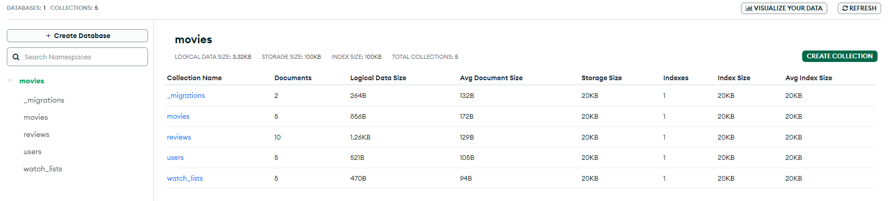
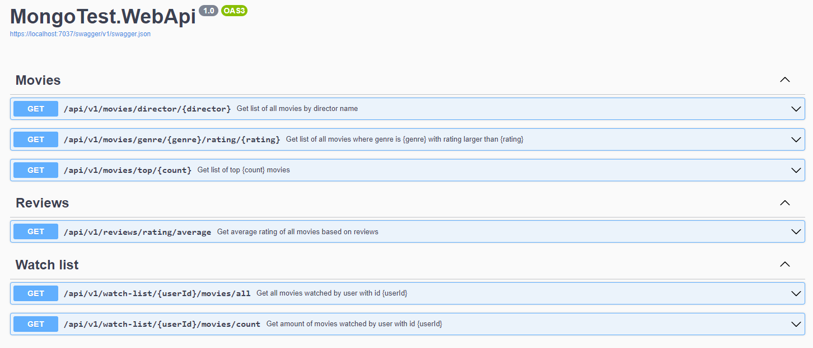

# MongoDB with .Net

## Task

_This task was auto generated by ChatGPT_

#### Task Description:

Create a MongoDB database for a movie streaming service with the following collections:

- `movies`
- `users`
- `watchlists`
- `reviews`

#### Collections and Indexes:

1. **Movies Collection**:

   - Fields:
     - `_id`: ObjectId
     - `title`: String
     - `director`: String
     - `genres`: Array of Strings
     - `release_date`: Date
     - `rating`: Double
     - `views`: Integer
   - Indexes:
     - Index on `title`
     - Compound index on `director` and `genres`
     - Index on `rating`

2. **Users Collection**:

   - Fields:
     - `_id`: ObjectId
     - `name`: String
     - `email`: String
     - `subscription_date`: Date
   - Indexes:
     - Index on `email`

3. **Watchlists Collection**:

   - Fields:
     - `_id`: ObjectId
     - `user_id`: ObjectId (Reference to users collection)
     - `movies`: Array of ObjectIds (References to movies collection)
   - Indexes:
     - Index on `user_id`

4. **Reviews Collection**:
   - Fields:
     - `_id`: ObjectId
     - `movie_id`: ObjectId (Reference to movies collection)
     - `user_id`: ObjectId (Reference to users collection)
     - `rating`: Integer
     - `review_text`: String
     - `review_date`: Date
   - Indexes:
     - Compound index on `movie_id` and `user_id`
     - Index on `rating`

#### Queries to Implement:

1. Find all movies by a specific director, sorted by release date (descending).
2. Find all movies in a specific genre with a rating higher than 8.
3. Aggregate query to find the average rating of each movie.
4. Find the top 5 most viewed movies.
5. Get the list of movies in a user's watchlist.
6. Aggregate query to find the total number of movies watched by each user.

## Results

### MongoDB collection list

### Swagger for MongoTest.WebApi

## References

- [Useful Tips For Getting Started With MongoDB in .NET Core](https://nexocode.com/blog/posts/getting-started-with-mongodb-in.net-core-applications/)
- [Create a web API with ASP.NET Core and MongoDB](https://learn.microsoft.com/en-us/aspnet/core/tutorials/first-mongo-app?view=aspnetcore-8.0&tabs=visual-studio)
- [MongoDBMigrations](https://bitbucket.org/i_am_a_kernel/mongodbmigrations/src/master/)
- [Tutorial: Create a minimal API with ASP.NET Core](https://learn.microsoft.com/en-us/aspnet/core/tutorials/min-web-api?view=aspnetcore-8.0&tabs=visual-studio)
